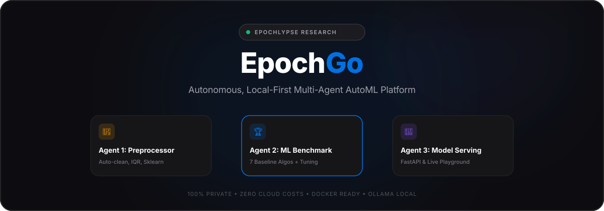
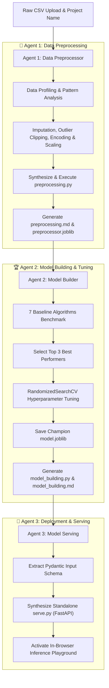

<div align="center">

# ⚡ EpochGo

**Autonomous, Local-First Multi-Agent AutoML Platform**  
*by Epochlypse Research &bull; Powered by CrewAI, Ollama, and Scikit-Learn / XGBoost / LightGBM / CatBoost*

[](https://www.docker.com/)
[](https://crewai.com)
[](https://ollama.ai)
[](https://fastapi.tiangolo.com)
[](LICENSE)

*Zero API keys. Zero cloud costs. 100% private and offline on your local machine.*

<br/>



</div>

---

## 🌟 Overview

**EpochGo** is an open-source, local-first AutoML software system developed by **Epochlypse Research**. Simply `git clone` the repository and run Docker. You get a localised link in your browser (`http://localhost:8000`), where you can create projects, drop in raw CSV datasets, and let a coordinated team of **three autonomous AI agents** do all the data science:

1. 🧹 **Agent 1: Data Preprocessor & Feature Architect**
   - Automatically detects patterns, missing values, extreme outliers (IQR), categorical encodings, scaling, and high-dimensional multicollinearity (PCA).
   - Generates and executes a standalone Scikit-Learn pipeline (`preprocessing.py`).
   - Produces a detailed before-vs-after comparison report (`preprocessing.md`).
   - Saves serialized transformer (`preprocessor.joblib`) and cleaned dataset (`cleaned_data.csv`).

2. 🏆 **Agent 2: Machine Learning Benchmark & Tuning Specialist**
   - Evaluates **7 baseline machine learning algorithms** without hyperparameter bias:
     - **Classification**: XGBoost, LightGBM, CatBoost, Random Forest, Extra Trees, Gradient Boosting, Logistic Regression.
     - **Regression**: XGBoost, LightGBM, CatBoost, Random Forest, Extra Trees, Gradient Boosting, Ridge Regression.
   - Evaluates baseline accuracy/F1/R²/RMSE and selects the **Top 3 contenders**.
   - Runs high-efficiency hyperparameter optimization (`RandomizedSearchCV`).
   - Generates reproducible training script (`model_building.py`) and comprehensive Markdown report (`model_building.md`).
   - Serializes the champion model to `model.joblib`.

3. 🚀 **Agent 3: MLOps & Model Serving Engineer**
   - Synthesizes a production-ready, standalone FastAPI microservice script (`serve.py`) with Pydantic type validation matching your dataset schema.
   - Enables an interactive, in-browser **Prediction Playground** to test predictions and probabilities in real time.
   - Generates ready-to-use `curl` and Python API snippets.

---

## 🚀 Quick Start (Single Command)

### Prerequisites
- Docker & Docker Compose installed.
- 16 GB RAM recommended (Apple Silicon M1/M2/M3/M4/M5 Mac, or Windows/Linux with 16GB RAM).

### 1. Clone & Run
```bash
git clone https://github.com/AryanDinakaran/EpochGo.git
cd EpochGo
docker compose up --build
```

### 2. Open Your Browser
Navigate to:
```
http://localhost:8000
```

That's it! EpochGo will automatically connect to Ollama, ensure the coding model is loaded, and start the web dashboard.

---

## 💻 Recommended Local Model & Hardware Benchmarks

| Metric | Target Specification |
| :--- | :--- |
| **Recommended Model** | **`qwen2.5-coder:7b`** |
| **Why This Model?** | World-class code synthesis, scikit-learn mastery, and precise Markdown report writing. |
| **VRAM / RAM Footprint** | ~4.7 GB RAM |
| **Target Hardware** | 16 GB RAM Mac (Apple Silicon M-Series) or PC |
| **Available Headroom** | Leaves >10 GB RAM free for parallel XGBoost / CatBoost / LightGBM model training |
| **Low-Resource Fallback** | `qwen2.5-coder:1.5b` or `qwen2.5-coder:3b` for 8GB environments |

> [!TIP]
> **Already have Ollama installed on your Mac?**
> You can save disk space and run native Metal GPU acceleration by pointing EpochGo to your existing Ollama instance:
> ```bash
> OLLAMA_BASE_URL=http://host.docker.internal:11434 docker compose up
> ```

---

## 🏗️ Architecture & Agent Pipeline



---

## 📂 Project Outputs & Generated Artifacts

Every project you create stores complete, reproducible artifacts inside `projects/<project_id>/`:

| File | Purpose |
| :--- | :--- |
| `raw_data.csv` | Original uploaded dataset |
| `cleaned_data.csv` | Transformed dataset after missing values, outliers, scaling & encoding |
| `preprocessor.joblib` | Scikit-Learn transformer pipeline for downstream inference |
| `preprocessing.py` | Standalone, reproducible Python script for data preparation |
| `preprocessing.md` | Comprehensive Markdown report profiling before-and-after distributions |
| `model.joblib` | Trained champion machine learning model artifact |
| `model_building.py` | Standalone, reproducible model training and evaluation script |
| `model_building.md` | Benchmark leaderboard (7 models), tuning stats, and feature importances |
| `serve.py` | Production FastAPI microservice ready to deploy anywhere |
| `metadata.json` | Project status, metric scoreboard, and feature schema |

---

## 🧪 Included Sample Datasets

EpochGo includes two pre-configured datasets in `sample_data/` for immediate testing:

1. **Customer Churn (`sample_data/customer_churn.csv`)**:
   - **Task**: Binary Classification (`churn`: 0 or 1)
   - Features: `age`, `tenure_months`, `monthly_charges`, `total_charges`, `contract`, `internet_service`, etc.
   - Includes real-world missing values and outliers to demonstrate agent cleaning.

2. **House Prices (`sample_data/house_prices.csv`)**:
   - **Task**: Regression (`price`)
   - Features: `square_feet`, `bedrooms`, `bathrooms`, `year_built`, `neighborhood`, `condition`, etc.

---

## 🛠️ Local Development (Without Docker)

If you prefer to run EpochGo directly on your host machine:

```bash
# 1. Clone repository
git clone https://github.com/AryanDinakaran/EpochGo.git
cd EpochGo

# 2. Create virtual environment
python3 -m venv venv
source venv/bin/activate

# 3. Install dependencies
pip install -r requirements.txt

# 4. Make sure Ollama is running
ollama serve
ollama pull qwen2.5-coder:7b

# 5. Start EpochGo
uvicorn epoch_go.main:app --host 0.0.0.0 --port 8000 --reload
```

---

## 📡 API Reference

- `GET /api/health` - Check service status and Ollama model connectivity.
- `GET /api/projects` - List all projects and execution states.
- `POST /api/projects` - Upload a CSV, name the project, and trigger the CrewAI pipeline.
- `GET /api/projects/{id}` - Retrieve project metadata, status, and benchmark leaderboard.
- `GET /api/projects/{id}/files/{filename}` - Retrieve generated Markdown reports and Python scripts.
- `GET /api/projects/{id}/download/{filename}` - Download `.joblib` models or `.py` scripts.
- `POST /api/projects/{id}/predict` - Run real-time predictions against the project's champion model.
- `WS /ws/projects/{id}` - Real-time WebSocket stream for agent reasoning logs.

---

## 🏛️ Maintained & Developed By

**Epochlypse Research**  
- **Lead Architect & Research**: Aryan Dinakaran ([@aryandinakaran](https://github.com/aryandinakaran))  
- **Affiliation**: IIT Madras &mdash; BS in Data Science & Applications  
- **Mission**: Local-first, private, reproducible multi-agent systems for high-leverage data science & machine learning engineering.  

For collaboration, research partnerships, or fellowship inquiries, reach out via [GitHub](https://github.com/aryandinakaran) or open an issue.

---

## 📄 License

MIT License. Free for personal, commercial, and research use.

